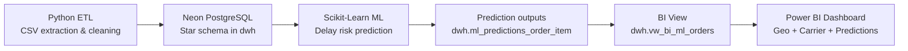
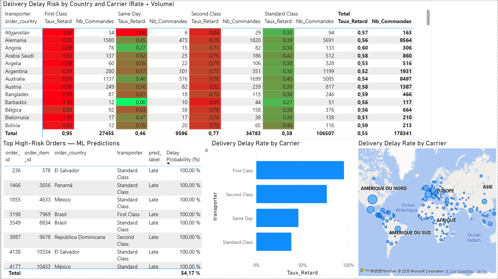

# supply-chain-etl-ml

**End-to-end Data Pipeline to predict supply chain delays.**

An end-to-end analytics project that transforms raw supply chain events into a cloud warehouse, trains an ML model to predict delay risk, and delivers decision-ready insights in Power BI.

## Why this project matters (ROI)

- Reduce late-delivery costs by proactively flagging high-risk orders.
- Prioritize operations by country and carrier using risk + volume signals.
- Improve SLA performance by focusing on false negatives (missed delays).
- Enable faster decision cycles with one BI layer connected to warehouse outputs.

## Architecture



## Data Model (Warehouse)

- Schema: `dwh`
- Dimensions: `dim_date`, `dim_customer`, `dim_product`, `dim_order_status`, `dim_shipping_mode`, `dim_market_location`
- Fact table: `fact_order_item`
- ML outputs:
  - `ml_predictions_order_item` (predicted labels/probabilities)
  - `vw_bi_ml_orders` (BI-ready consolidated view)

## Model Performance

- RandomForest (main model): **Accuracy ~0.73**
- 5-Fold CV (stability check): **~0.73 mean**, low variance
- Baselines:
  - Logistic Regression: lower than RandomForest
  - XGBoost (light): lower than RandomForest in this setup

## Power BI Result

Add your final dashboard screenshot to:

`assets/powerbi-dashboard.png`

Then this preview will render on GitHub:



## Repository Structure

```text
.
├── script.ipynb
├── DataCoSupplyChainDataset.csv
├── .env               # local only (ignored)
├── .gitignore
├── assets/
│   └── powerbi-dashboard.png   # add this file before publishing
└── README.md
```

## Quick Start

1. Create and activate your Python environment.
2. Set `NEON_DATABASE_URL` in `.env`.
3. Run `script.ipynb` top-to-bottom.
4. In Power BI, connect to PostgreSQL and load `dwh.vw_bi_ml_orders`.

## Security Notes

- Never commit `.env`.
- Rotate Neon credentials if exposed.

## Next Improvements

- Probability threshold tuning based on business cost matrix.
- Hyperparameter optimization (Optuna/GridSearch).
- Automated retraining/monitoring pipeline.
- Data quality rules for geospatial consistency.

